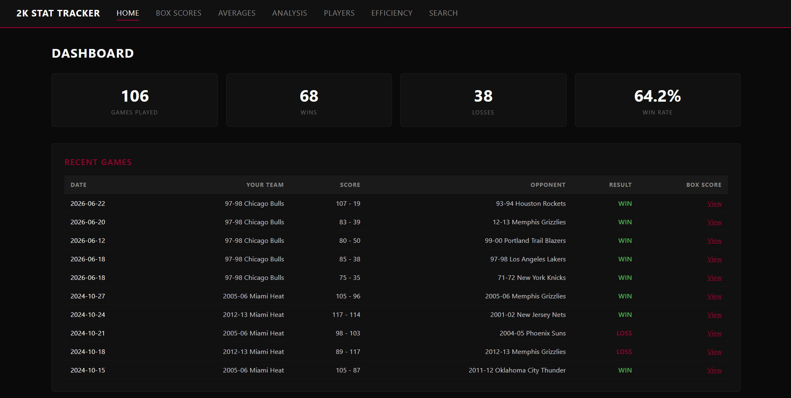
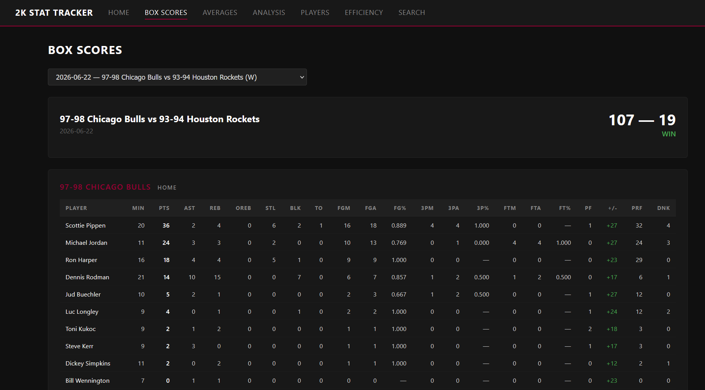
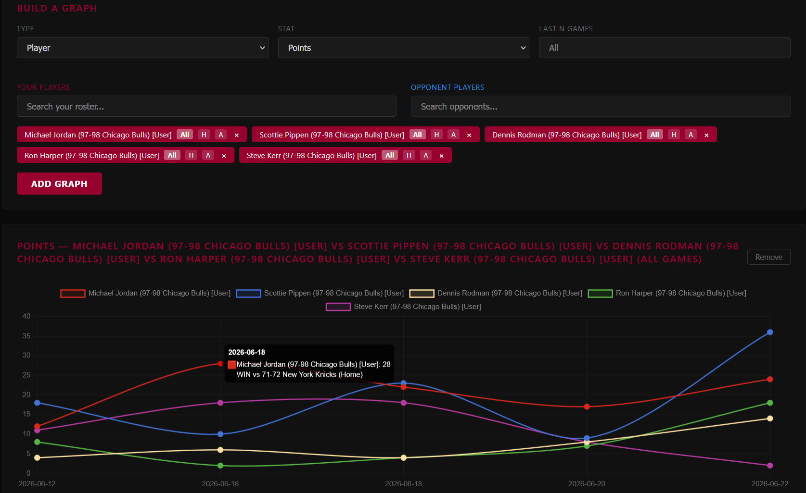
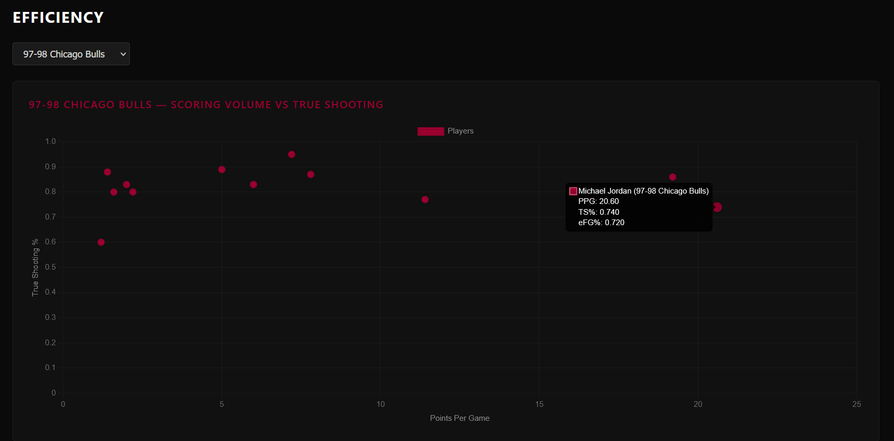
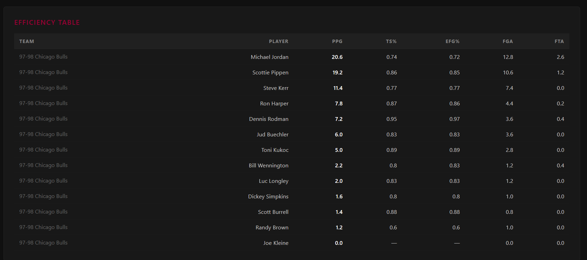
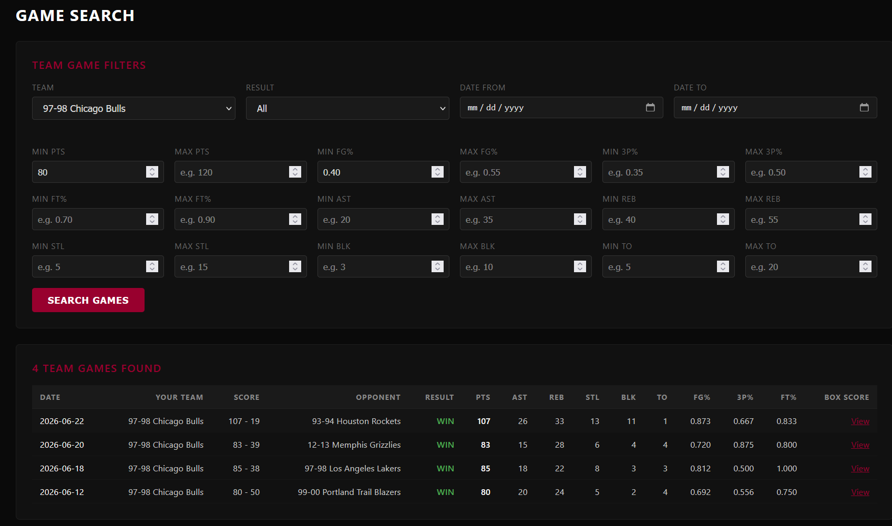

# PlayerMetrics

## Overview

PlayerMetrics is a basketball stats tracking web app built for organizing and analyzing custom game data. The app turns recorded box score data into searchable tables, matchup views, player and team summaries, and custom visualizations.

The project is designed to make manually tracked basketball stats easier to explore. Instead of reviewing separate spreadsheets or CSV files, PlayerMetrics presents the data through box scores, filters, comparison tools, and graphs that make performance trends easier to understand.

## Features

- View recorded game results and detailed box scores
- Search team stats with optional filters for opponent, games played, and shooting performance
- Search player stats with optional filters for team, opponent, games played, and shooting performance
- Review matchup tables that separate overall performance from performance against specific opponents
- Build custom team and player graphs using selected stats, teams, players, and game ranges
- Filter graph results by recent games, opponent matchups, and head-to-head availability
- View efficiency metrics including field goal percentage, three-point percentage, free throw percentage, effective field goal percentage, and true shooting percentage
- Explore player efficiency through a true shooting scatter plot

## Tech Stack

- Python
- Flask
- SQLite
- Pandas
- HTML
- CSS
- JavaScript
- Chart.js

## Project Status

PlayerMetrics is currently in active development. The main box score, search, matchup table, and graphing features are functional, while the codebase and interface are still being refined.

## Screenshots

### Dashboard Overview


### Box Scores


### Player Points Comparison Graph


### True Shooting Scatter Plot


### Efficiency Table


### Game Search Results


## Running Locally

1. Clone the repository.
2. Install dependencies:

   ```bash
   pip install -r requirements.txt
   ```

3. Run the application:

   ```bash
   python app.py
   ```

4. Open the local address shown in the terminal in your browser.

   Example: `http://127.0.0.1:5000`

## Future Improvements

- Add a more polished data entry workflow for new games and box scores
- Improve layout consistency across different screen sizes
- Add more advanced chart options and comparison views
- Continue refactoring the codebase into smaller, more maintainable modules
- Prepare the app for production deployment beyond Flask’s development server
